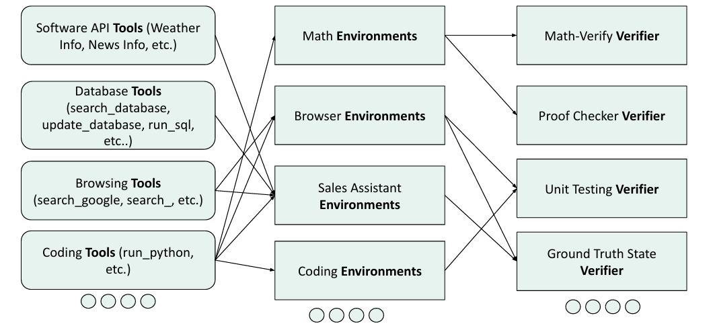

# Title : Post-Training Verifiable Agents by Jiantao Jiao

Post-Training Verifiable Agents are autonomous AI agents refined after their initial pre-training phase using post-training techniques that include supervised fine-tuning and reinforcement learning with verifiable rewards. These agents have their tool-use, decision-making, or responses validated by clear, rule-based verification functions or verifiable workflows, ensuring that their outputs meet predefined correctness or safety criteria.

Ex-A verifiable agent might be a large language model fine-tuned post-training using verifiable rewards where its output for a task like code execution or mathematical problem-solving is checked by a rule-based function that returns a binary score indicating correctness (1 for correct, 0 for incorrect). This method ensures that the agent’s training is aligned with objective ground-truth outcomes and allows robust, scalable evaluation without subjective bias.

Thus, a Post-Training Verifiable Agent is defined by its use of verifiable reward signals or audits during the post-training phase, which enable the agent to perform reliably on tasks where correctness can be objectively measured.

##### How does Agentic Models differs from the classical LLMs ?

Agentic models differ from traditional LLMs primarily in their source of feedback and method of alignment. Traditional "chat" models are primarily aligned to maximize human preference through supervised tuning and reinforcement learning from human feedback (RLHF), focusing on generating responses that are helpful, harmless, and align with user values.

Agentic models, by contrast, are designed to maximize verifiable rewards derived from direct interaction with an environment, systems, or explicit external tests—in addition to (but not limited to) human preference. This means agentic models can reason, make decisions, set goals, and interact autonomously, evaluating their own outputs not just by pleasing people, but by passing external, objective criteria.

| Feature                 | Traditional (Human-Aligned) LLMs   | Agentic Models (Environment-Feedback Aligned)                |
| ----------------------- | ---------------------------------- | ------------------------------------------------------------ |
| Primary Feedback Source | Human judgments and preferences    | Verifiable rewards from environment or tests                 |
| Interaction             | Generates responses per prompt     | Interacts and plans, possibly across multiple turns          |
| Decision-Making         | Lacks autonomy, reactive           | Proactive, autonomous, plans and adapts                      |
| Task Execution          | Single-step, no environment impact | Multi-step, interacts with tools/APIs                        |
| Reasoning               | Limited, "in the prompt"           | Breaks down problems, adapts strategies                      |
| Example                 | ChatGPT tuned for helpful dialog   | An agent solving tasks with API/tool use, verified by reward |

Agentic models thus represent a leap towards autonomous, goal-driven, and verifiably correct AI systems, moving beyond passive language modeling to active problem-solving and environment-adapted behavior.

##### How Earlier Classical Models were trained to be a great chatbots?

Earlier models like traditional chatbots and LLM-based assistants were trained primarily to optimize for human preferences in conversation. These models used human-assistant chat logs, with responses ranked by human annotators for quality, to train reward models and further fine-tune language models to mirror preferred behaviors through algorithms such as Supervised Fine-Tuning (SFT), Proximal Policy Optimization (PPO), and Generative Reward Policy Optimization (GRPO).

###### Process Overview

* **Human-Assistant Chats:** Collect a large corpus of conversations where humans interact with an AI assistant.
* **Ranking Responses:** Human reviewers evaluate and rank possible assistant responses for prompts such as “Hey, how are you?” based on helpfulness, correctness, and safety.
* **Reward Model:** This ranking is used to train a reward model, which measures how well generated responses match human preferences.
* **Optimization Algorithms (SFT, PPO, GRPO):** The base model is then fine-tuned or reinforced using these reward signals, so that it learns to generate outputs preferred by humans; common approaches include SFT with rejection sampling, PPO, and GRPO.
* **Outcome:** The resulting model is highly skilled at producing conversational responses that maximize human satisfaction and engagement, ideal for dialog-based tasks.

These models were not designed for real-world autonomous agentic tasks, but rather for excelling as conversational tools that align closely to explicit human feedback. Thus, To move beyond preference-based conversational models, several additional capabilities are necessary for tasks where correctness and interaction with multiple entities matter.

##### What is more necessary conversation vs intraction?

Conversation is inherently non-verifiable; it lacks objective ground truth, so traditional models rely on modeling human preference through subjective feedback. However, many real-world tasks involve problems with clear correct answers and require broader interactions than just with the user.

###### Why Preference Modeling Alone is Insufficient

* **Non-verifiability in Conversation:** Dialogue rarely has an exact correct answer; models must be tuned to human tastes instead of objective truth.
* **Isolation to User Interaction:** Chat-focused systems only interact with humans and do not engage with broader environments or external systems.

###### What Is Necessary for More Complex Tasks

* **Verifiability:** Many tasks, such as code generation, mathematical problem solving, or scientific reasoning, demand answers that can be objectively verified as correct or incorrect.
* **Task Grounding:** Instead of subjective ranking, models need reward signals that reflect passing concrete tests or satisfying formal criteria.
* **Multi-entity Interaction:** Advanced systems must interact not only with users but also with external knowledge sources, APIs, environments, or agents, to gather relevant information and understand the full state of a problem.
* **Stateful Reasoning:** Tasks often require keeping track of evolving state across multiple interactions with various entities, rather than responding in isolation.

Enabling complex, verifiable behavior thus requires agentic models able to reason about the environment, interact autonomously with multiple entities, and optimize for objective correctness rather than just subjective human liking.

##### How Today’s Models Are Trained To Be Great Agents ?

Modern agentic models are trained to act as effective agents that can achieve explicit objectives specified by prompts like “I want to achieve this”. Unlike earlier chat models focused on preference, these models are trained using ground-truth signals from rubrics, environment states, or unit tests, emphasizing verifiable correctness rather than mere conversational quality.

###### How Today’s Agentic Models Are Trained

* **Prompt:** The model receives a goal-oriented prompt, e.g., "I want to achieve this".
* **Training Algorithms:** Training leverages algorithms like Supervised Fine-Tuning (SFT), Proximal Policy Optimization (PPO), and Generative Reward Policy Optimization (GRPO), but now these focus on maximizing correctness, not preference.
* **Verifiable Feedback:**
  * Feedback comes from clear ground truths—rubrics, known environment states, and passing unit tests—rather than subjective human ratings.
  * This ensures binary or scalar rewards based on whether outputs are correct or fulfill the task, allowing automated, objective evaluation.
* **Interaction in Sandboxed Environments:**
  * Models operate and are tested in controlled environments ("sandboxes"), where they can use tools, call APIs, or manipulate environment states to achieve goals.
  * However, unlike full open-ended tools use, some training regimens may withhold certain tools or restrict actions to test specific capabilities.
* **Outcome:** The model evolves to maximize correctness—i.e., achieving specified goals reliably and passing formal tests—by reasoning, planning, and acting in environment-driven scenarios, not just dialog.

This shift enables agentic models to solve practical, verifiable tasks autonomously, using tool use and environment interaction as core mechanisms for achieving measurable success.

##### What is needed to train the verifiable agentic models?

Training verifiable agentic models involves a systematic multi-step process to ensure that these agents behave intelligently, verifiably, and aligned with given objectives. Here is a clear 6-step breakdown:

###### 6 Steps to Train Verifiable Agentic Models

1. **Get Good Verifiable Training Data**
   Collect high-quality datasets that include verifiable outcomes such as unit tests, rubric-based evaluations, environment states, or clearly defined success criteria. This data is essential for training models to optimize correctness, not just preference.
2. **Define Intelligence**
   Explicitly define what intelligence means for the agentic model in the problem context. This includes specifying goal-directed behavior, reasoning capabilities, adaptability, interaction modalities, and success metrics.
3. **Develop Recipes to Feed Verifiable Data to Models**
   Design training methodologies (recipes) that effectively incorporate verifiable data into the training process through supervision, reinforcement learning, or other strategies like constitutional AI or direct preference optimization.
4. **Create Multi-Stage Training Pipelines**
   Employ a progressive approach including pre-training on large text corpora, instruction tuning using supervised fine-tuning, and alignment phases with reinforcement learning aimed at goal-directed, verifiable behavior.
5. **Simulate and Use Sandboxed Environments with Tools**
   Train the agent to interact autonomously within controlled environments where it can invoke APIs, tools, or compose multi-step actions, ensuring safe exploration and learning of tool use before deploying to real-world scenarios.
6. **Monitor, Evaluate, and Iterate**
   Continuously evaluate agent performance against success criteria, include human-in-the-loop validation for edge cases, and iterate on training data, reward models, and policy optimization to refine agent behavior over time.

These steps collectively enable the creation of intelligent, goal-driven agents whose decisions and actions are verifiable through objective outcomes and automated checks, distinct from preference-only conversational agents.

##### Step-1 : Getting good training data!

Step 1 in training verifiable agentic models focuses on obtaining good training data that enables the model to maximize verifiable rewards through direct interaction with the environment, tools, and verifiers.

###### Key Points in Step 1: Getting Good Training Data

1. **The Environment**
   The model receives tokens that describe the current state of the environment and the user’s intentions. The environment could be a code repository, a web browser, a database, or any system where the agent operates and observes state changes. This state information is essential for the model to understand context and make appropriate decisions.
2. **Tools**
   The model generates tokens that invoke software tools designed to provide supplementary information or actions to the environment. These tools can be APIs fetching real-time data or services that modify the environment’s state. By using tools effectively, the model can gather richer context and act to maximize reward from the task verifier.
3. **Verifier**
   The model’s outputs are evaluated by verifiers that check correctness based on task-specific criteria. Verifiers can be unit tests for code generation, mathematical proof checkers, DOM scripts for verifying web interactions, and other automated validation mechanisms. The model is trained to maximize the reward signal generated by these verifiers, focusing on objective correctness rather than subjective preference.

This triad of environment, tools, and verifiers forms the foundation of verifiable training data, enabling agentic models to learn from concrete, objective feedback for real-world, goal-oriented tasks.

##### How do we train a good agent model ?

To train a good agent model, the critical first step is acquiring and leveraging high-quality, diverse training data focused on multiple environments, tools, and verifiers.

###### Key Principles for Training a Good Agent Model

* **Train to Understand Many Different Environments (Point 1):**
  The agent must be exposed to varied environment states, such as code repositories, web browsers, databases, or any relevant operational context. This diversity helps the model generalize and adapt its decision-making across different real-world scenarios.
* **Train to Use Many Different Kinds of Tools (Point 2):**
  The agent should learn to interact effectively with a wide range of software tools and APIs that provide additional information or can change the environment’s state. Familiarity with diverse tools expands the agent’s capabilities and flexibility in solving tasks.
* **Train to Do Well Under Many Different Verifiers (Point 3):**
  Verifiers, such as unit tests for code, mathematical proof checkers, or automated correctness scripts, assess the agent’s outputs objectively. Training under diverse verifiers ensures robustness and reliability, enabling the agent to optimize for verifiable correctness, not just human preference.

###### Importance of Diversity

Environment and verifier diversity are essential to prevent overfitting to narrow task types and to build a generalizable, intelligent agent capable of thriving in multiple contexts and achieving verifiable success across varied goals.

This tripartite approach of diverse environments, tools, and verifiers forms the cornerstone of effective agent model training.

##### How to link many different kind of environments, tools and verifiers for training verifiable agentic models ?

The multi-dimensional linking ensures that agentic models interact with diverse environments through appropriate tools and are assessed by robust, domain-specific verifiers.

##### Why verifiers quality is very importent along with the scale ?

Verifier quality is critically important in training verifiable agentic models to ensure reliable and correct outcomes. High-quality verifiers minimize false positives (wrong answers rewarded) and false negatives (correct answers not rewarded), which is essential, especially for complex or nuanced tasks.

###### Key Points on Verifier Quality

1. **Reward All Correct Variants**
   If multiple valid answers exist, the verifier should reward all of them fairly.
   * Example: For the question “How much change will I get back if I buy a drink for fifty cents and give a dollar?” valid answers can be ½ or 2/4. The verifier should accept all mathematically equivalent answers to avoid penalizing correct variation.
2. **Avoid Rewarding Incorrect Answers**
   When specific criteria are set, such as requiring the simplest form of an answer, the verifier should strictly enforce this.
   * Example: For “Give me the simplest form of the change for fifty cents from a dollar,” only ½ should be accepted, not 2/4, to avoid false positives that reward incorrect responses.
3. **Importance for Difficult Prompts**
   As task complexity increases, verifier precision is paramount to avoid training agents on incorrect feedback, which can degrade performance and reliability.

###### Implications for Training

* **Calibrated Metrics:** Verifiers should use calibrated, reliable metrics that reflect true correctness across varied response formats.
* **Human-in-the-Loop:** For ambiguous or borderline cases, human evaluation can help refine the verifier to reduce errors. 
* **Automated Checks:** Where possible, automated tests like unit tests, proof checkers, and consistency validators provide objective, scalable verification.

In summary, ensuring verifier quality with minimal false positives and false negatives is foundational to guiding agentic models toward genuinely correct, useful, and generalizable behavior when dealing with complex and multi-faceted tasks.

##### Step 2: Getting Good Evaluation Data!

Step 2 in building verifiable agentic models focuses on creating robust evaluation data and metrics to measure what "works" effectively.

###### Key Points for Step 2: Getting Good Evaluation Data

* **Define What "Works" Means:**
  Clear quantitative evaluation metrics are essential to understand agent performance and improvement areas beyond just training data.
* **Expectations for Agents:**
  1. Agents must successfully use many different tools, e.g., APIs, databases, browsers.
  2. They should perform well across diverse use cases spanning various industries or task types.
  3. They must understand and operate under vaguely specified or ambiguous instructions.
  4. Agents should interact reliably with different software systems (e.g., cursor control, aider tools).
  5. Robustness against errors, unexpected inputs, and environmental changes is critical.
* **Quantitative Tracking:**
  All these dimensions require clear evaluation benchmarks and automated tracking systems to measure performance, errors, and robustness metrics. This helps identify which agent capabilities work well and which need refinement.

###### Outcome

With comprehensive evaluation data and metrics aligned to real-world expectations, developers can iteratively improve agent models by pinpointing strengths and weaknesses under operational conditions, ensuring continual progress toward intelligent, reliable, and flexible agents.

In summary, good evaluation frameworks complement good training data to close the loop on verifiable agentic model development.

##### How Do We Train A Good Agent Model?

The second step to train a good agent model is to develop strong evaluation mechanisms, including off-the-shelf benchmarks and specialized agent harnesses, to quantitatively measure performance across various important dimensions.

###### Second Step: Good Evaluations

1. **Off-The-Shelf Benchmarks for General Tasks and Use Cases**
   These benchmarks assess agent performance on typical environments and use cases:
   * **SWEBench:** A suite including OpenHands, MiniSWE (bash only), and others that evaluate coding abilities and command-line interface tasks.
   * **HLE (Human-Level Evaluation):** Includes OpenSWE and Aider-SWEBench for coding with added harnesses supporting search and tool use.
2. **Agent Harnesses for Interactions with Software Systems**
   Harnesses simulate software interfaces where agents interact, such as cursors or other system tools, to evaluate multi-modal agent capabilities:
   * ToolCalling, TauBench, BFCL (Benchmarks for tool invocation and environment interaction).
   * Assess the ability to call APIs, use software features, and handle complex function compositions.
3. **Focused Unit-Test Evaluations for Robustness and Instruction Following**
   These tests measure adherence to structured outputs, conditional instructions, and long task sequences:
   * **Instruction Following and Conditional Instructions:** IFBench and structured adherence benchmarks test how well agents follow explicit rules and conditional tasks.
   * **Long Trajectories:** Evaluation of agent behavior over extended sequences of actions to verify long-term planning and consistency.
4. **Knowledge and Browser-based Evaluations**
   * **BrowserComp:** Tests agent abilities in browser-related tasks without external search support, analyzing autonomous browsing and info extraction.
   * Knowledge-HLE and others evaluate understanding and application of domain-specific information in tasks.

###### Summary

These evaluation suites and harnesses collectively ensure the agent is tested comprehensively on environment diversity, tool use, instruction adherence, interaction robustness, and long-horizon problem solving. This step ensures that model improvements and training recipes can be iteratively optimized based on measurable outcomes.To train a good agent model, the second essential step is to establish strong, diverse evaluation frameworks that measure agent performance in real-world-like conditions.

## References

1. [Agentic AI vs Traditional AI (2025): Key Differences &amp; Use Cases](https://www.classicinformatics.com/blog/agentic-vs-traditional-ai)
2.
